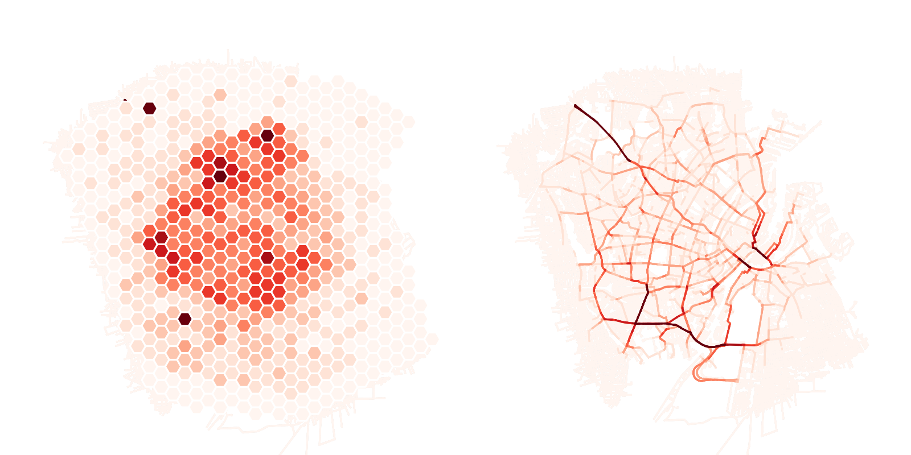
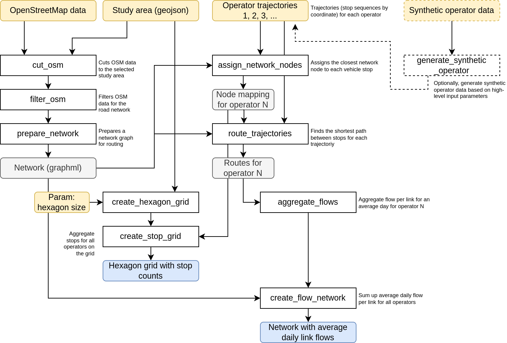

# DISCO Processing pipeline for Copenhagen by IRT SystemX



This repository contains an example processing pipeline for the Copenhagen living lab in the Horizon Europe project [DISCO](https://discoprojecteu.com/) developed by [IRT SystemX](https://www.irt-systemx.fr/).

## Overview

The repository provides a pipeline that takes the following inputs:

- An OpenStreetMap cut-out of a region (here Denmark)
- The shape of a study area (here Copenhagen)
- Trajectory data by logistics operators

The trajectory data per operator is structured as a CSV file containing at least the following columns:

```
vehicle_id,date,longitude,latitude
```

For each, operator, we, hence, need to know the (ordered) stop sequence of one or multiple vehicles over one or multiple days. Each day per operator should have a unique identifier.

The pipeline will then perform the following processing steps:

- A road network, based on the study area shape, will be extracted from OpenSteetMap and prepared for routing.
- The trajectories and stops of all operators will be mapped to the road network of the study area.
- The trajectories of all operators will be routed by the shortest path to identify the probable routes that the vehicles may have taken in reality.

Finally, the pipeline aggregates the obtained information. The following outputs are generated:

- A geographic analysis file that counts the number of performed stops by the operators for an average day on a hexagon grid (size is configurable).
- A geographic analysis file that counts the number of passing vehicles on each road segment in the road network on an average day.

## Prerequisites

For the OpenStreetMap cutting functionality (see below) to work, a `conda` distribution like [miniforge](https://conda-forge.org/download/) needs to be installed on the system.

## Repository structure

The repository is structred as a self-contained processing pipeline in Python. Dependencies are managed by the [poetry](https://python-poetry.org/) package manager, which [must be installed on the system](https://python-poetry.org/docs/#installation). It is configured to create a virtual environment inside `.venv` in the root directory of the repository. To prepare all dependencies, call:

```bash
poetry install --no-root
```

The code itself is structured as a processing pipeline using [snakemake](https://snakemake.readthedocs.io). It manages the execution of multiple processing steps (written as Jupyter notebooks) in the right order. The structure of the processing pipeline and the individual processing steps are defined in `workflow/Snakefile`. To run the processing pipeline, call the following command in the root directory of this repository:

```bash
poetry run snakemake --sdm conda -c1 all 
```

This command can be called out-of-the-box after placing the minimum input data into the right place (see below). The execution of the whole pipeline should take about 15 minutes. This includes the cutting and preparation of the road network, which are steps that are only executed once and not every time the operator data changes.

## Input data

The minimal input of the pipeline is the following:

- Download an [OpenStreetMap snapshot of Denmark from Geofabrik](https://download.geofabrik.de/europe/denmark.html) and place the file `denmark-latest.osm.pbf` into `resources`.

A shape file of the Copenhagen area is already provided in `resources/study_area.gpkg`. Note that the paths to those files can be configured in `resources/config.yml`.

If specific (real) operator data is available, each operator should obtain a folder with its name in `resources/operators/{name}` and the operator should be added to the list of `operators` inside `resources/config.yml`.

By default, two synthetic operators, `synthetic1` and `synthetic2` are autotomatically generated based on some high-level statistic information, an operating area and depot locatiosn defined in `resources/synthetic.gpkg`.

## Output data

After running the pipeline, the aggregation files are updated, either analyzing the two synthetic operators or any additional operator that has been added in `resources/operators/{name}` and which has been added to the `operators` list in `resources/config.yml`.

The geographic data can be visualized, for instance using [QGIS](https://qgis.org/). In case you want to use QGIS, a readily prepared project file that accesses `results/aggregation/stops.gpkg` and `results/aggregation/flows.gpkg` is available in `workflow/Mapping.qgz`.

## Schema

The whole pipeline with inputs and outputs is described in the following schema:


